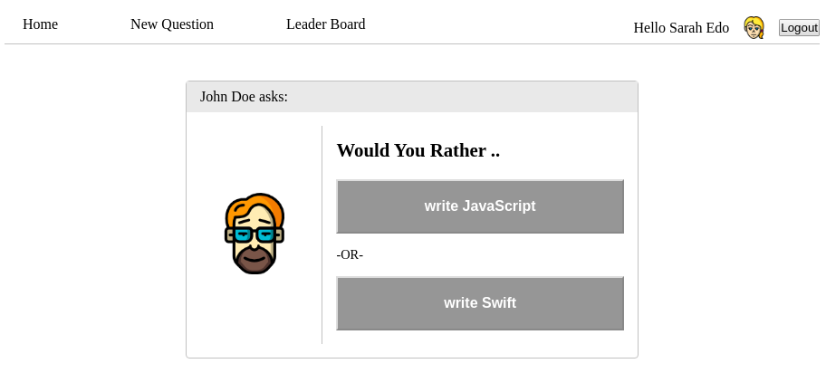

# Would You Rather

Would You Rather app is a rebuild project for the famous game. It's part of Udacity's React nanodegree as practice on Redux. The project counts on Redux's store as a container for the centralized state and React for rendering UI.

The game logic goes around voting on 2-answers polls, then the user sees how he/she compares with other players. The user can also post polls/questions. And can be ranked against other users on the leader board.

The project counts on a simulated database for questions and users. New users can't be created and player interactions aren't preserved on a real database. That's because server and database handling isn't the goal behind this project and the project is merely focused on correct implementation of Redux with React. Read [below](#database-simulation) about the database.

The project also isn't focused on design at all. Minimal design and styling was added to get the app working. Everything here is about Redux.

There's a static version of the app living over [gh-pages](https://github.com/i-mw/would-you-rather/tree/gh-pages) branch in this repository. This version is deployed to github pages and you can view it at https://i-mw.github.io/would-you-rather/.



## Table of Contents

* [Quick Start](#quick-start)
* [Direct Dependencies](#direct-dependencies)
* [File Structure](#file-structure)
* [Database Simulation](#database-simulation)
* [Create React App](#create-react-app)
* [Contributing](#contributing)

## Quick Start

To get started right away:

* clone:  `git clone https://github.com/i-mw/would-you-rather`
* move to the project:  `cd would-you-rather`
* install all project dependencies with:  `npm install`
* start the development server with:  `npm start`

## Direct Dependencies

The project has these direct code dependencies, as indicated in `package.json` file:
* react
* react-dom
* react-redux
* react-redux-loading-bar
* react-router-dom
* redux
* redux-thunk

And one Development dependency:
* react-scripts

## File Structure

The project uses 'rails-type' file structure

```bash
─── src
    ├── components 
    ├── actions
    ├── reducers
    ├── middleware
    ├── utils
    ├── index.css
    └── index.js
```

## Database Simulation

The project counts on a simulated database for questions and users. New users can't be created and player interactions aren't preserved on a real database. That's because server and database handling isn't the goal behind this project and the project is merely focused on correct implementation of Redux with React.

The whole database exists in `utils/_DATA.js` file. As, there're only 3 users available for the player to choose from and log in with. The player interactions are shown immediately. but, once he/she refreshes his/her browser the data are reset.

This database file was provided by Udacity as the only starter code. You can find it [here](https://github.com/udacity/reactnd-project-would-you-rather-starter)

## Create React App

This project was bootstrapped with [Create React App](https://github.com/facebookincubator/create-react-app). You can find more information [here](https://github.com/facebookincubator/create-react-app/blob/master/packages/react-scripts/template/README.md).

## Contributing

As this project is part of a program and meant only for personal improvement, Its not open for contribution. But you can refer to a feature or a bug in Issues section.
